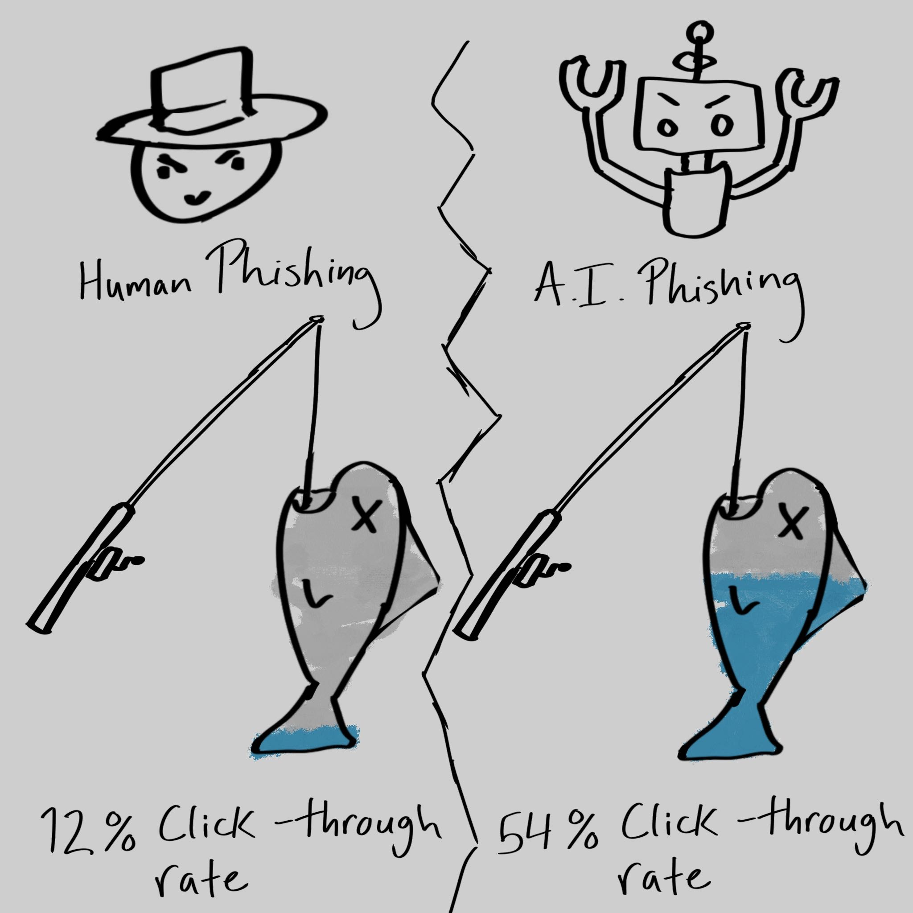

This week, Damien Jackson and I talk about some recent cases in which generative AI was successfully used in large-scale scamming operations. We also cover some of the statistics around phishing scams and their effectiveness when synthesized by humans and AI respectively. Thanks for listening; we hope you enjoy!

---
According to a 2025 paper, AI-based phishing scams have a click-through rate of approximately 54%.
By comparison, phishing content produced manually results in a 12% click-through rate.  

Some of the generated images of Brad Pitt

One of the advertisements for "Willy's Chocolate Experience"
