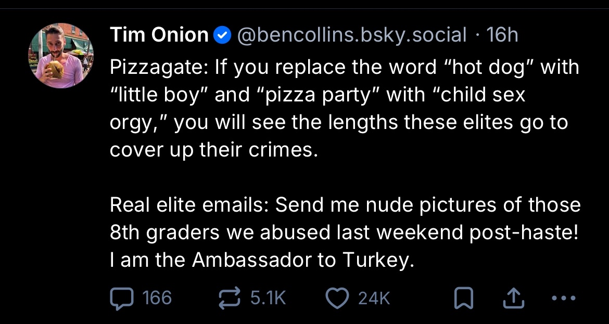

This week, Damien Jackson and I talk about memes in regards to a case study by Stephen Best, Mia You, and Damon Ross Young. We cover many examples including some of our favorites, and further discuss their impact on the broader society. This is our final podcast together and we had lots of fun recording it! Thanks once again for tuning in; catch you on the flip side.

Provided below are some of the memes discussed in the podcast (in no particular order):
---

[Lessons in Meme Culture video about the 'We Are Charlie Kirk' song.](https://www.youtube.com/watch?v=pwVJhK79_qI)

[Npesta's reaction to beating Kenos](https://youtu.be/Bs1kVySdUtI?t=113)
[And his subsequent commentary on the internet's reaction](https://www.youtube.com/watch?v=bBjKEokItKM)

[The Onion's 'Jeffrey Epstein: Bad Pedophile'](https://www.youtube.com/watch?v=XjhSoGcQhWU)

